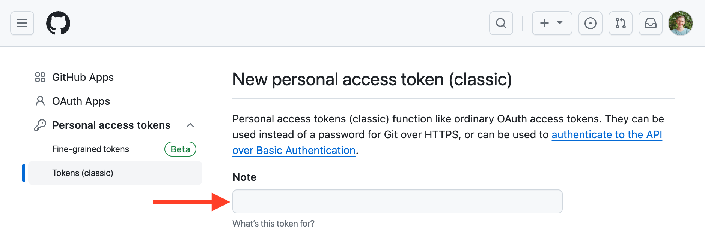

In this course, you'll learn how to use coroutines in the example of a program that loads the contributors for all of the repositories under the given GitHub organization.

So, you'll be using the GitHub API in your project. To get access, you'll need to provide your GitHub account name and either a password or a token. If you have two-factor authentication enabled, a token will be enough.

Generate a new GitHub token to use the GitHub API with [your account](https://github.com/settings/tokens/new):

1. Specify the name of your token, for example, `coroutines-tutorial`:

2. Do not select any scopes. **Click Generate** token at the bottom of the page.
3. Copy the generated token to safe place. You won't be able to see him again in the future. If you lose it, you will need to create a new one.

For a more detailed description, you can look at [this article](https://kotlinlang.org/docs/coroutines-and-channels.html#generate-a-github-developer-token)