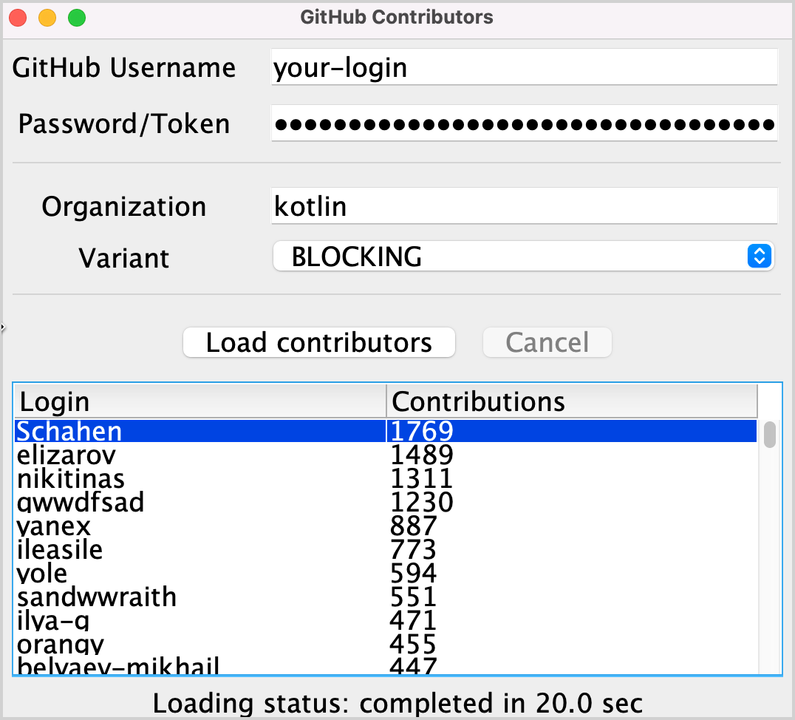

### Task condition
This task helps you familiarize yourself with the task domain. Currently, each contributor's name is repeated
several times, once for every project they have taken part in. Implement the `aggregate()` function combining the users
so that each contributor is added only once. The `User.contributions` property should contain the total number of
contributions of the given user to _all_ the projects. The resulting list should be sorted in descending order according
to the number of contributions.

Open [src/tasks/Aggregation.kt](course://Coroutines/Aggregation/src/tasks/Aggregation.kt) and implement the `List<User>.aggregate()` function. Users should be sorted by the total
number of their contributions.

The corresponding test file [test/tasks/AggregationKtTest.kt](course://Coroutines/Aggregation/test/tasks/AggregationKtTest.kt) shows an example of the expected result.

> You can jump between the source code and the test class automatically by using the [IntelliJ IDEA shortcut](https://www.jetbrains.com/help/idea/create-tests.html#test-code-navigation)
> `Ctrl+Shift+T` / ⇧ ⌘ T

After implementing this task, the resulting list for the "kotlin" organization should be similar to the following:

For a more detailed description, you can look at [this article](https://kotlinlang.org/docs/coroutines-and-channels.html#task-1)