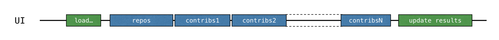

You will use the [Retrofit](https://square.github.io/retrofit/) library to perform HTTP requests to GitHub. It allows requesting the list of repositories under the given organization and the list of contributors for each repository. See [src/contributors/GitHubService.kt](course://Coroutines/Blocking requests/src/contributors/GitHubService.kt):

```kotlin
interface GitHubService
```

This API is used by the `loadContributorsBlocking()` function to fetch the list of contributors for the given organization.


1. Open [src/tasks/Request1Blocking.kt](course://Coroutines/Blocking requests/src/tasks/Request1Blocking.kt) to see its implementation.
   * At first, you get a list of the repositories under the given organization and store it in the `repos` list. Then for
        each repository, the list of contributors is requested, and all of the lists are merged into one final list of
        contributors.
   * `getOrgReposCall()` and `getRepoContributorsCall()` both return an instance of the `*Call` class (`#1`). At this point,
     no request is sent.
   * `*Call.execute()` is then invoked to perform the request (`#2`). `execute()` is a synchronous call that blocks the
     underlying thread.
   * When you get the response, the result is logged by calling the specific `logRepos()` and `logUsers()` functions (`#3`).
     If the HTTP response contains an error, this error will be logged here.
   * Finally, get the response's body, which contains the data you need. For this tutorial, you'll use an empty list as a
     result in case there is an error, and you'll log the corresponding error (`#4`).
2. To avoid repeating `.body() ?: emptyList()`, an extension function `bodyList()` is declared.
3. Run the program again and take a look at the system output in IntelliJ IDEA. It should have something like this:

    ```text
    1770 [AWT-EventQueue-0] INFO  Contributors - kotlin: loaded 40 repos
    2025 [AWT-EventQueue-0] INFO  Contributors - kotlin-examples: loaded 23 contributors
    2229 [AWT-EventQueue-0] INFO  Contributors - kotlin-koans: loaded 45 contributors
    ...
    ```

    * The first item on each line is the number of milliseconds that have passed since the program started, then the thread
      name in square brackets. You can see from which thread the loading request is called.
    * The final item on each line is the actual message: how many repositories or contributors were loaded.

   This log output demonstrates that all of the results were logged from the main thread. When you run the code with a _BLOCKING_
   option, the window freezes and doesn't react to input until the loading is finished. All of the requests are executed from
   the same thread as the one called `loadContributorsBlocking()` is from, which is the main UI thread (in Swing, it's an AWT
   event dispatching thread). This main thread becomes blocked, and that's why the UI is frozen:

   

   After the list of contributors has loaded, the result is updated.
4. In [src/contributors/Contributors.kt](course://Coroutines/Blocking requests/src/contributors/Contributors.kt), find the `loadContributors()` function responsible for choosing how
   the contributors are loaded and look at how `loadContributorsBlocking()` is called.

    * The `updateResults()` call goes right after the `loadContributorsBlocking()` call.
    * `updateResults()` updates the UI, so it must always be called from the UI thread.
    * Since `loadContributorsBlocking()` is also called from the UI thread, the UI thread becomes blocked and the UI is
      frozen.


