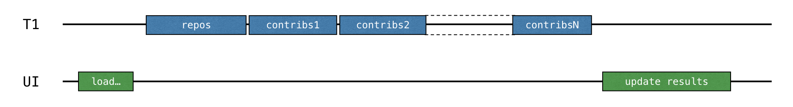

The previous solution works, but it blocks the thread and therefore freezes the UI. A traditional approach that avoids this
is to use _callbacks_.

Instead of calling the code that should be invoked right after the operation is completed, you can extract it
into a separate callback, often a lambda, and pass that lambda to the caller in order for it to be called later.

To make the UI responsive, you can either move the whole computation to a separate thread or switch to the Retrofit API
which uses callbacks instead of blocking calls.
### Use a background thread

1. Open [src/tasks/Request2Background.kt](course://Coroutines/Callbacks/src/tasks/Request2Background.kt) and see its implementation. First, the whole computation is moved to a different
   thread. The `thread()` function starts a new thread:

    ```kotlin
    thread {
        loadContributorsBlocking(service, req)
    }
    ```

   Now that all of the loading has been moved to a separate thread, the main thread is free and can be occupied by other
   tasks:

   

2. The signature of the `loadContributorsBackground()` function changes. It takes an `updateResults()`
   callback as the last argument to call it after all the loading completes.
3. Now when the `loadContributorsBackground()` is called, the `updateResults()` call goes in the callback, not immediately
   afterward as it did before:

    ```kotlin
    loadContributorsBackground(service, req) { users ->
        SwingUtilities.invokeLater {
            updateResults(users, startTime)
        }
    }
    ```

   By calling `SwingUtilities.invokeLater`, you ensure that the `updateResults()` call, which updates the results,
   happens on the main UI thread (AWT event dispatching thread).

However, if you try to load the contributors via the `BACKGROUND` option, you can see that the list is updated but
nothing changes.

## Task

Fix the `loadContributorsBackground()` function in [src/tasks/Request2Background.kt](course://Coroutines/Callbacks/src/tasks/Request2Background.kt) so that the resulting list is shown
in the UI.

For a more detailed description, you can look at [this article](https://kotlinlang.org/docs/coroutines-and-channels.html#callbacks)