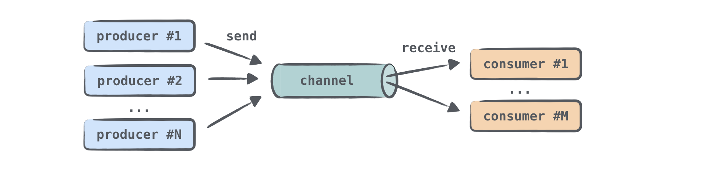

#### Consecutive vs concurrent

An `updateResults()` callback is called after each request is completed:


This code doesn't include concurrency. It's sequential, so you don't need synchronization.

The best option would be to send requests concurrently and update the intermediate results after getting the response
for each repository:


To add concurrency, use _channels_.

## Channels

Writing code with a shared mutable state is quite difficult and error-prone (like in the solution using callbacks).
A simpler way is to share information by communication rather than by using a common mutable state.
Coroutines can communicate with each other through _channels_.

Channels are communication primitives that allow data to be passed between coroutines. One coroutine can _send_
some information to a channel, while another can _receive_ that information from it:


A coroutine that sends (produces) information is often called a producer, and a coroutine that receives (consumes)
information is called a consumer. One or multiple coroutines can send information to the same channel, and one or multiple
coroutines can receive data from it:



When many coroutines receive information from the same channel, each element is handled only once by one of the
consumers. Once an element is handled, it is immediately removed from the channel.

You can think of a channel as similar to a collection of elements, or more precisely, a queue, in which elements are added
to one end and received from the other. However, there's an important difference: unlike collections, even in their
synchronized versions, a channel can _suspend_ `send()`and `receive()` operations. This happens when the channel is empty
or full. The channel can be full if the channel size has an upper bound.

`Channel` is represented by three different interfaces: `SendChannel`, `ReceiveChannel`, and `Channel`, with the latter
extending the first two. You usually create a channel and give it to producers as a `SendChannel` instance so that only
they can send information to the channel.
You give a channel to consumers as a `ReceiveChannel` instance so that only they can receive from it. Both `send`
and `receive` methods are declared as `suspend`:

```kotlin
interface SendChannel<in E> {
    suspend fun send(element: E)
    fun close(): Boolean
}

interface ReceiveChannel<out E> {
    suspend fun receive(): E
}

interface Channel<E> : SendChannel<E>, ReceiveChannel<E>
```

The producer can close a channel to indicate that no more elements are coming.

Several types of channels are defined in the library. They differ in how many elements they can internally store and
whether the `send()` call can be suspended or not.
For all of the channel types, the `receive()` call behaves similarly: it receives an element if the channel is not empty;
otherwise, it is suspended.

### Unlimited channel
An unlimited channel is the closest analog to a queue: producers can send elements to this channel and it will
keep growing indefinitely. The <code>send()</code> call will never be suspended.
If the program runs out of memory, you'll get an <code>OutOfMemoryException</code>.
The difference between an unlimited channel and a queue is that when a consumer tries to receive from an empty channel,
it becomes suspended until some new elements are sent.

### Buffered channel
The size of a buffered channel is constrained by the specified number.
Producers can send elements to this channel until the size limit is reached. All of the elements are internally stored.
When the channel is full, the next `send` call on it is suspended until more free space becomes available.

### Rendezvous channel
The "Rendezvous" channel is a channel without a buffer, the same as a buffered channel with zero size.
One of the functions (<code>send()</code> or <code>receive()</code>) is always suspended until the other is called. 
If the <code>send()</code> function is called and there's no suspended <code>receive</code> call ready to process the element, then <code>send()</code>
is suspended. Similarly, if the <code>receive</code> function is called and the channel is empty or, in other words, there's no
suspended <code>send()</code> call ready to send the element, the <code>receive()</code> call is suspended. 

The "rendezvous" name ("a meeting at an agreed time and place") refers to the fact that <code>send()</code> and <code>receive()</code>
should "meet on time".


### Conflated channel
A new element sent to the conflated channel will overwrite the previously sent element, so the receiver will always
get only the latest element. The <code>send()</code> call is never suspended.
 

When you create a channel, specify its type or the buffer size (if you need a buffered one):

```kotlin
val rendezvousChannel = Channel<String>()
val bufferedChannel = Channel<String>(10)
val conflatedChannel = Channel<String>(CONFLATED)
val unlimitedChannel = Channel<String>(UNLIMITED)
```

By default, a "Rendezvous" channel is created.

In the following task, you'll create a "Rendezvous" channel, two producer coroutines, and a consumer coroutine. Check out [ChannelsSample.kt](course://Coroutines/Channels/src/samples/ChannelsSample.kt)

<div class="hint">

> Watch [this video](https://www.youtube.com/watch?v=HpWQUoVURWQ) for a better understanding of channels.
>

</div>


### Task

In [src/tasks/Request7Channels.kt](course://Coroutines/Channels/src/tasks/Request7Channels.kt), implement the function `loadContributorsChannels()` that requests all of the GitHub
contributors concurrently and shows intermediate progress at the same time.

Use the previous functions, `loadContributorsConcurrent()` from [Request5Concurrent.kt](course://Coroutines/Channels/src/tasks/Request5Concurrent.kt)
and `loadContributorsProgress()` from [Request6Progress.kt](course://Coroutines/Channels/src/tasks/Request6Progress.kt).


<div class="hint"> 

Different coroutines that concurrently receive contributor lists for different repositories can send all of the received
results to the same channel:

```kotlin
val channel = Channel<List<User>>()
for (repo in repos) {
    launch {
        val users = TODO()
        // ...
        channel.send(users)
    }
}
```

Then the elements from this channel can be received one by one and processed:

```kotlin
repeat(repos.size) {
    val users = channel.receive()
    // ...
}
```

Since the `receive()` calls are sequential, no additional synchronization is needed.
</div>