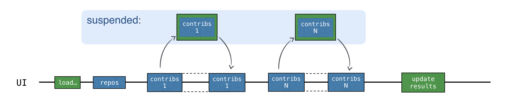
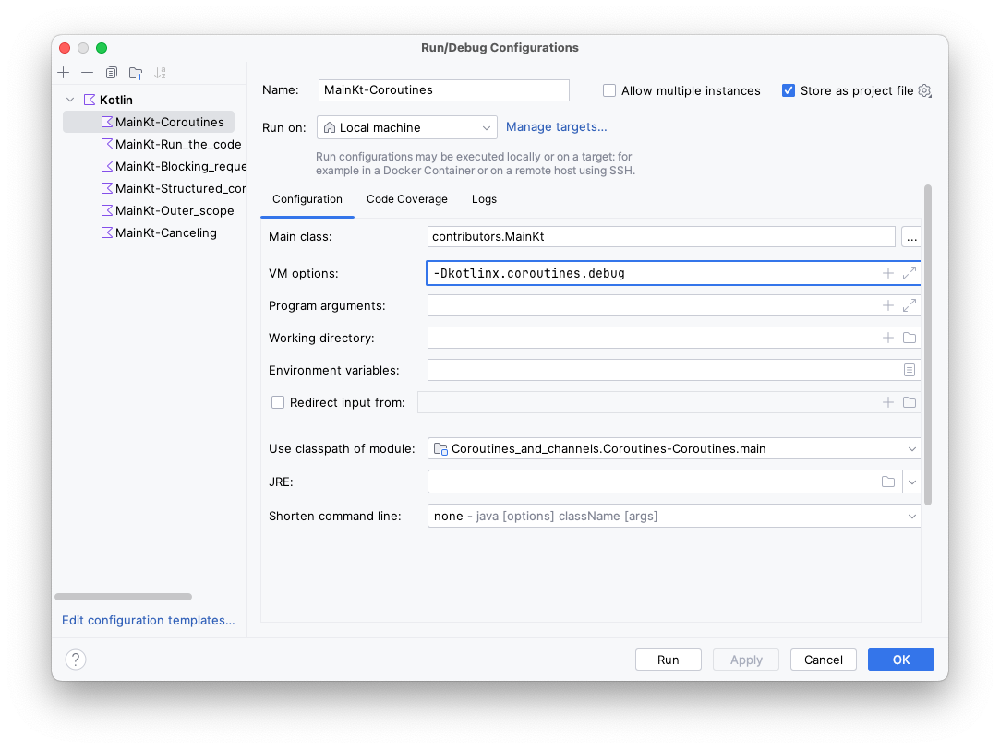

The code with suspending functions looks similar to the "blocking" version. The major difference from the blocking version
is that instead of blocking the thread, the coroutine is suspended:

```text
block -> suspend
thread -> coroutine
```

> Coroutines are often called lightweight threads because you can run code on coroutines, similar to how you run code on
> threads. The operations that were blocking before (and had to be avoided) can now suspend the coroutine instead.


### Starting a new coroutine

If you look at how `loadContributorsSuspend()` is used in [src/contributors/Contributors.kt](course://Coroutines/Coroutines/src/contributors/Contributors.kt), you can see that it's
called inside `launch`. `launch` is a library function that takes a lambda as an argument:

```kotlin
launch {
    val users = loadContributorsSuspend(req)
    updateResults(users, startTime)
}
```

Here `launch` starts a new computation that is responsible for loading the data and showing the results. The computation
is suspendable – when performing network requests, it is suspended and releases the underlying thread.
When the network request returns the result, the computation is resumed.

Such a suspendable computation is called a _coroutine_. So, in this case, `launch` _starts a new coroutine_ responsible
for loading data and showing the results.

Coroutines run on top of threads and can be suspended. When a coroutine is suspended, the
corresponding computation is paused, removed from the thread, and stored in memory. Meanwhile, the thread is free to be
occupied by other tasks:


When the computation is ready to be continued, it is returned to a thread (not necessarily the same one).

In the `loadContributorsSuspend()` example, each "contributors" request now waits for the result using the suspension
mechanism. First, the new request is sent. Then, while waiting for the response, the whole "load contributors" coroutine
that was started by the `launch` function is suspended.

The coroutine resumes only after the corresponding response is received:



While the response is waiting to be received, the thread is free to be occupied by other tasks. The UI stays responsive,
despite all the requests taking place on the main UI thread:

1. Run the program using the _SUSPEND_ option. The log confirms that all of the requests are sent to the main UI thread:

    ```text
    2538 [AWT-EventQueue-0 @coroutine#1] INFO  Contributors - kotlin: loaded 30 repos
    2729 [AWT-EventQueue-0 @coroutine#1] INFO  Contributors - ts2kt: loaded 11 contributors
    3029 [AWT-EventQueue-0 @coroutine#1] INFO  Contributors - kotlin-koans: loaded 45 contributors
    ...
    11252 [AWT-EventQueue-0 @coroutine#1] INFO  Contributors - kotlin-coroutines-workshop: loaded 1 contributors
    ```

2. The log can show you which coroutine the corresponding code is running on. For the configuration invoked by clicking `Run` button this is already set up. To enable it in your own configurations, open **Run | Edit configurations**
   and add the `-Dkotlinx.coroutines.debug` VM option:


    &shortcut:ChooseRunConfiguration;

   The coroutine name will be attached to the thread name while `main()` is run with this option. You can also
   modify the template for running all of the Kotlin files and enable this option by default.

Now all of the code runs on one coroutine, the "load contributors" coroutine mentioned above, denoted as `@coroutine#1`.
While waiting for the result, you shouldn't reuse the thread for sending other requests because the code is
written sequentially. The new request is sent only when the previous result is received.

Suspending functions treat the thread fairly and don't block it for "waiting". However, this doesn't yet bring any concurrency
into the picture.

For a more detailed description, you can look at [this article](https://kotlinlang.org/docs/coroutines-and-channels.html#coroutines)