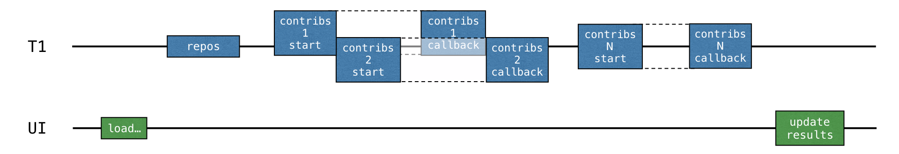

In the previous solution, the whole loading logic is moved to the background thread, but that still isn't the best use of
resources. All of the loading requests go sequentially and the thread is blocked while waiting for the loading result,
while it could have been occupied by other tasks. Specifically, the thread could start loading another request to
receive the entire result earlier.

Handling the data for each repository should then be divided into two parts: loading and processing the
resulting response. The second _processing_ part should be extracted into a callback.

The loading for each repository can then be started before the result for the previous repository is received (and the
corresponding callback is called):

The Retrofit callback API can help achieve this. The `Call.enqueue()` function starts an HTTP request and takes a
callback as an argument. In this callback, you need to specify what needs to be done after each request.

Open [src/tasks/Request3Callbacks.kt](course://Coroutines/Retrofit callback API/src/tasks/Request3Callbacks.kt) and see the implementation of `loadContributorsCallbacks()` that uses this API.

* For convenience, this code fragment uses the `onResponse()` extension function declared in the same file. It takes a
  lambda as an argument rather than an object expression.
* The logic for handling the responses is extracted into callbacks: the corresponding lambdas start at lines `#1` and `#2`.

However, the provided solution doesn't work. If you run the program and load contributors by choosing the _CALLBACKS_
option, you'll see that nothing is shown. However, the tests that immediately return the result pass.

## Task

Rewrite the code in the [src/tasks/Request3Callbacks.kt](course://Coroutines/Retrofit callback API/src/tasks/Request3Callbacks.kt) file so that the loaded list of contributors is shown.

For a more detailed description, you can look at [this article](https://kotlinlang.org/docs/coroutines-and-channels.html#use-the-retrofit-callback-api)