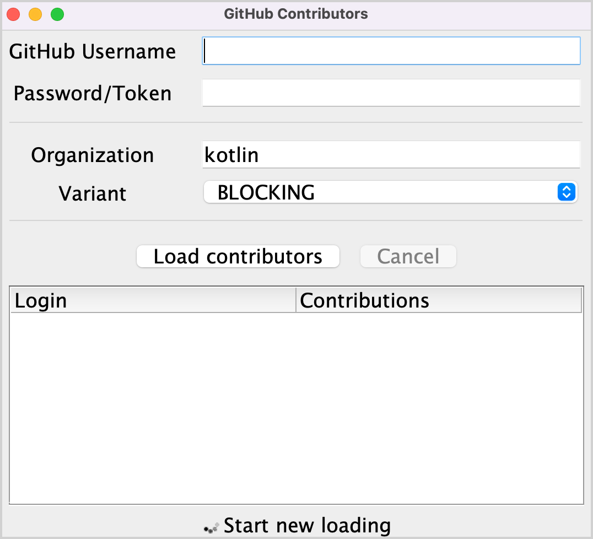

The program loads the contributors for all of the repositories under the given organization (named “kotlin” by default). Later you'll add logic to sort the users by the number of their contributions.

Open the [src/contributors/main.kt](course://Coroutines/Run the code/src/contributors/main.kt) file and run the `main()` function or just use the "Run" button below. You'll see the following window:

1. If the font is too small, adjust it by changing the value of `setDefaultFontSize(18f)` in the `main()` function.
2. Provide your GitHub username and token (or password) in the corresponding fields.
3. Make sure that the BLOCKING option is selected in the Variant dropdown menu.
4. Click Load contributors. The UI should freeze for some time and then show the list of contributors.
5. Open the program output to ensure the data has been loaded. The list of contributors is logged after each successful request.

There are different ways of implementing this logic: by using [blocking requests](https://kotlinlang.org/docs/coroutines-and-channels.html#blocking-requests) or [callbacks](https://kotlinlang.org/docs/coroutines-and-channels.html#callbacks). You'll compare these solutions with one that uses [coroutines](https://kotlinlang.org/docs/coroutines-and-channels.html#coroutines) and see how [channels](https://kotlinlang.org/docs/coroutines-and-channels.html#channels) can be used to share information between different coroutines.

