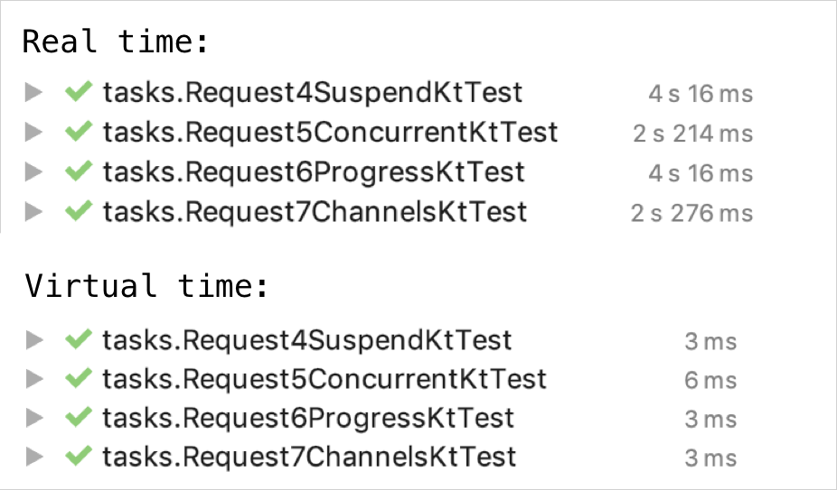

Let's now test all solutions to check that the solution with concurrent coroutines is faster than the solution with
the `suspend` functions, and check that the solution with channels is faster than the simple "progress" one.

In the following task, you'll compare the total running time of the solutions. You'll mock a GitHub service and make
this service return results after the given timeouts:

```text
repos request - returns an answer within 1000 ms delay
repo-1 - 1000 ms delay
repo-2 - 1200 ms delay
repo-3 - 800 ms delay
```

The sequential solution with the `suspend` functions should take around 4000 ms (4000 = 1000 + (1000 + 1200 + 800)).
The concurrent solution should take around 2200 ms (2200 = 1000 + max(1000, 1200, 800)).

For the solutions that show progress, you can also check the intermediate results with timestamps.

The corresponding test data is defined in [test/contributors/testData.kt](course://Coroutines/Testing/test/contributors/testData.kt), and the files [Request4SuspendKtTest.kt](course://Coroutines/Testing/test/tasks/Request4SuspendKtTest.kt),
[Request7ChannelsKtTest.kt](course://Coroutines/Testing/test/tasks/Request7ChannelsKtTest.kt), and so on contain the straightforward tests that use mock service calls.

However, there are two problems here:

* These tests take too long to run. Each test takes around 2 to 4 seconds, and you need to wait for the results each
  time. It's not very efficient.
* You can't rely on the exact time the solution runs because it still takes additional time to prepare and run the code.
  You could add a constant, but then the time would differ from machine to machine. The mock service delays
  should be higher than this constant so you can see a difference. If the constant is 0.5 sec, making the delays
  0.1 sec won't be enough.

A better way would be to use special frameworks to test the timing while running the same code several times (which increases
the total time even more), but that is complicated to learn and set up.

To solve these problems and make sure that solutions with provided test delays behave as expected, one faster than the other,
use _virtual_ time with a special test dispatcher. This dispatcher keeps track of the virtual time passed from
the start and runs everything immediately in real time. When you run coroutines on this dispatcher,
the `delay` will return immediately and advance the virtual time.

Tests that use this mechanism run fast, but you can still check what happens at different moments in virtual time. The
total running time drastically decreases:

{width=700}

To use virtual time, replace the `runBlocking` invocation with a `runTest`. `runTest` takes an
extension lambda to `TestScope` as an argument.
When you call `delay` in a `suspend` function inside this special scope, `delay` will increase the virtual time instead
of delaying in real time:

```kotlin
@Test
fun testDelayInSuspend() = runTest {
    val realStartTime = System.currentTimeMillis() 
    val virtualStartTime = currentTime
        
    foo()
    println("${System.currentTimeMillis() - realStartTime} ms") // ~ 6 ms
    println("${currentTime - virtualStartTime} ms")             // 1000 ms
}

suspend fun foo() {
    delay(1000)    // auto-advances without delay
    println("foo") // executes eagerly when foo() is called
}
```

You can check the current virtual time using the `currentTime` property of `TestScope`.

The actual running time in this example is several milliseconds, whereas virtual time equals the delay argument, which
is 1000 milliseconds.

To get the full effect of "virtual" `delay` in child coroutines,
start all of the child coroutines with `TestDispatcher`. Otherwise, it won't work. This dispatcher is
automatically inherited from the other `TestScope`, unless you provide a different dispatcher:

```kotlin
@Test
fun testDelayInLaunch() = runTest {
    val realStartTime = System.currentTimeMillis()
    val virtualStartTime = currentTime

    bar()

    println("${System.currentTimeMillis() - realStartTime} ms") // ~ 11 ms
    println("${currentTime - virtualStartTime} ms")             // 1000 ms
}

suspend fun bar() = coroutineScope {
    launch {
        delay(1000)    // auto-advances without delay
        println("bar") // executes eagerly when bar() is called
    }
}
```

If `launch` is called with the context of `Dispatchers.Default` in the example above, the test will fail. You'll get an
exception saying that the job has not been completed yet.

You can test the `loadContributorsConcurrent()` function this way only if it starts the child coroutines with the
inherited context, without modifying it using the `Dispatchers.Default` dispatcher.

You can specify the context elements like the dispatcher when _calling_ a function rather than when _defining_ it,
which allows for more flexibility and easier testing.

> The testing API that supports virtual time is [Experimental](components-stability.md) and may change in the future.
>
{type="warning"}

By default, the compiler shows warnings if you use the experimental testing API. To suppress these warnings, annotate
the test function or the whole class containing the tests with `@OptIn(ExperimentalCoroutinesApi::class)`.
Add the compiler argument instructing the compiler that you're using the experimental API:

```kotlin
compileTestKotlin {
    kotlinOptions {
        freeCompilerArgs += "-Xuse-experimental=kotlin.Experimental"
    }
}
```

In the project corresponding to this tutorial, the compiler argument has already been added to the Gradle script.

### Task

Refactor the following tests in [tests/tasks/](course://Coroutines/Testing/test/tasks/) to use virtual time instead of real time:

* Request4SuspendKtTest.kt
* Request5ConcurrentKtTest.kt
* Request6ProgressKtTest.kt
* Request7ChannelsKtTest.kt

Compare the total running times before and after applying your refactoring.